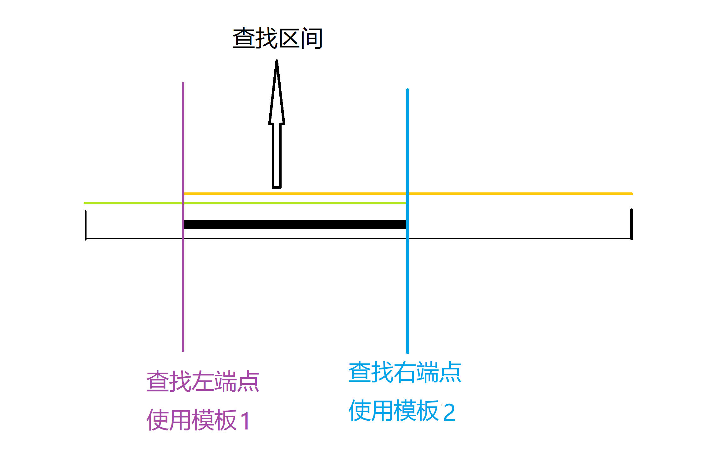

### 模板1
    while (l < r)
        {
            int mid = l + r >> 1;
            if (q[mid] >= x) r = mid;
            else l = mid + 1;
        }
### 模板2
    while (l < r)
            {
                int mid = l + r + 1 >> 1;
                if (q[mid] <= x) l = mid;
                else r = mid - 1;
            }

### 模板1找的是大于等于x的最左端的，也就是第一个大于等于x的

### 模板2找的是小于等于x的最右端的，也就是最后一个小于等于x的

### 关于二分模板问题
1）
一个mid = (l+r)>>1
一个mid = (l+r+1)>>1
加不加1 完全取决于 l = mid 还是r = mid
l等于mid时必须+1向上取整 不然会陷入l=l的死循环
r = mid 时候不用加1 因为下一步l = r 直接会退出循环
2)
这两个模板解决的是 找>=||<=||>||< 某个数的
最左或最右的位置 但这个数不一定在二分的数组中
如果在就能准确找到
如果不在 找到的就是最接近答案的数（你要找大于等于5的第一个数）但
数组中没有5 那找到的就是6的位置(如果有6的话)
所以二分是一定有答案的
我觉得这个二分模板就是解决了我上面说的（>=||<=||>||< ）这四种情况

